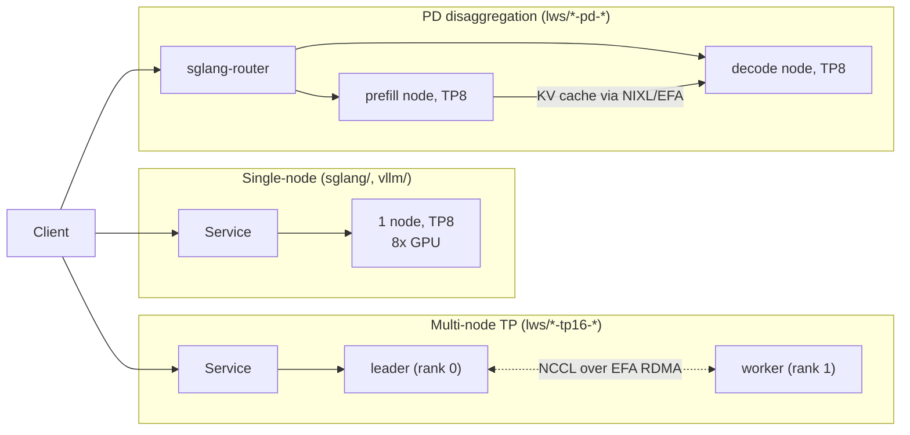

# LLM Inference on Amazon EKS with NVIDIA GPUs

Working examples for serving open-weight LLMs on Amazon EKS with NVIDIA GPU
instances — from single-GPU deployments to multi-node tensor parallelism over
EFA and prefill/decode disaggregation. Manifests are organized by serving stack;
models covered include GLM-5.2 (753B MoE), DeepSeek-R1/V3.2, the R1 distills,
Qwen, gpt-oss, and Llama 4.

**Looking for a specific model?** See [docs/MODEL-INDEX.md](docs/MODEL-INDEX.md)
— the by-model view of every manifest, with instance types and maintenance status.

> **💰 Cost warning**: the examples target real GPU capacity. Entry-level
> manifests run on a single g6e instance (a few $/hour), but the flagship
> examples use `p5en.48xlarge` (8× H200) — **tens of dollars per hour per node**,
> and the multi-node examples use two. Karpenter provisions nodes as soon as you
> apply a manifest and consolidates them after you delete it — see
> [Cleanup](#cleanup) and verify nothing is left running.

## Repository Layout

```
.
├── nodepool.yaml               # Karpenter NodePool (NVIDIA GPU instances)
├── open-webui.yaml             # Optional chat UI (point OPENAI_API_BASE_URLS at any model Service)
├── docs/
│   ├── MODEL-INDEX.md          # By-model index of all manifests
│   ├── GLM-5.2-BENCHMARK.md    # GLM-5.2 benchmark: TP8 vs TP16 vs PD-disagg on p5en
│   ├── PD_DISAGGREGATION.md    # Prefill/decode disaggregation architecture deep-dive
│   └── benchmark-commands.md   # genai-perf / bench_serving command reference
└── k8s-manifest/
    ├── priority-class.yaml     # PriorityClass used by the serving pods
    ├── sglang/                 # Single-node SGLang deployments
    ├── vllm/                   # Single-node vLLM deployments
    ├── lws/                    # Multi-node: LeaderWorkerSet + EFA (TP across nodes, PD-disagg)
    │   └── Dockerfile.efa-*    # EFA-enabled SGLang image builds (suffix = sglang version)
    └── genai-perf/             # Load-test client pod (no GPU)
```

## Deployment Shapes

| Shape | When to use | Example |
|---|---|---|
| **Single-node** (`sglang/`, `vllm/`) | Model fits one node's GPUs; simplest ops, no cross-node traffic | `sglang/glm-5.2-fp8-p5en.yaml` — 753B FP8 MoE on 8× H200, TP8 |
| **Multi-node TP** (`lws/lws-*-tp16-*.yaml`) | Model too big for one node, or hard TTFT SLO at high concurrency | `lws/lws-glm-5.2-tp16-p5en.yaml` — TP16 across 2 nodes via EFA |
| **PD disaggregation** (`lws/lws-*-pd-*.yaml`) | Strict ITL SLO or decode-heavy traffic; prefill and decode scale independently | `lws/lws-glm-5.2-pd-p5en.yaml` — NIXL KV transfer over EFA RDMA + sglang-router |



Head-to-head numbers for all three shapes on the same hardware:
[docs/GLM-5.2-BENCHMARK.md](docs/GLM-5.2-BENCHMARK.md).

## Prerequisites

- EKS cluster with [Karpenter](https://karpenter.sh/); GPU capacity for the
  instance types named in each manifest (`nodeSelector`)
- `kubectl apply -f nodepool.yaml -f k8s-manifest/priority-class.yaml`
- Multi-node (`lws/`) additionally needs:
  - [LeaderWorkerSet](https://github.com/kubernetes-sigs/lws) controller
  - EFA device plugin (`aws-efa-k8s-device-plugin`) on the GPU nodes
  - An EFA-enabled image — build from `k8s-manifest/lws/Dockerfile.efa-*`
    and push to your registry (see [k8s-manifest/lws/README.md](k8s-manifest/lws/README.md))
- Models are pulled from HuggingFace on first start and cached on node-local
  NVMe via `hostPath: /mnt/k8s-disks/0/...` — this path assumes the EKS
  GPU-optimized AMI's instance-store RAID setup. If your nodes mount NVMe
  elsewhere (or have none), adjust the `hostPath` in the manifest or switch the
  cache volume to EBS/FSx. Large models (750 GB+) take a while on first start.
- All example models are openly downloadable. For gated HuggingFace models,
  create a Secret and inject it as `HF_TOKEN`:

  ```bash
  kubectl create secret generic hf-token --from-literal=token=hf_xxx
  ```

  then add to the container env:

  ```yaml
  - name: HF_TOKEN
    valueFrom: { secretKeyRef: { name: hf-token, key: token } }
  ```

## Quick Start (single-node example)

```bash
# infra
kubectl apply -f nodepool.yaml -f k8s-manifest/priority-class.yaml

# deploy GLM-5.2-FP8 on 1x p5en.48xlarge (Karpenter provisions the node)
kubectl apply -f k8s-manifest/sglang/glm-5.2-fp8-p5en.yaml

# wait for weights download + engine start, then test
kubectl get pods -l app=glm-5-2 -w
kubectl run curl --rm -it --restart=Never --image=curlimages/curl -- \
  curl -s http://glm-5-2.default.svc.cluster.local/v1/chat/completions \
  -H 'Content-Type: application/json' \
  -d '{"model":"zai-org/GLM-5.2-FP8","messages":[{"role":"user","content":"hi"}],"max_tokens":32}'
```

Optional chat UI: edit `OPENAI_API_BASE_URLS` in `open-webui.yaml` to point at
your model's Service, then `kubectl apply -f open-webui.yaml`.

## Load Testing

Deploy the client pod and run genai-perf against any model Service in-cluster:

```bash
kubectl apply -f k8s-manifest/genai-perf/genai-perf-triton-2606.yaml
```

Full command reference (including thinking-model pitfalls and version-specific
flag changes): [docs/benchmark-commands.md](docs/benchmark-commands.md).

## Hard-Won Notes

Condensed from the benchmark writeups — details in [docs/](docs/):

- **`--mem-fraction-static` 0.80 is the safe line** for SGLang under heavy
  8K-input load on H200, single- and multi-node; 0.85 OOM-crashed both shapes.
- **Multi-node TP needs high concurrency to pay off** — at low concurrency the
  cross-node allreduce tax makes TP16 slower than TP8.
- **PD disaggregation ratio must match the traffic** — 1P:1D inverts on
  prefill-heavy (long-input) workloads; the prefill node bottlenecks while
  decode idles.
- **Reasoning models need thinking disabled for clean benchmarks** — nested
  `chat_template_kwargs.enable_thinking:false`, not a flat key.

## Cleanup

Delete what you deployed; Karpenter consolidates the empty GPU nodes
automatically (see `disruption` in `nodepool.yaml`):

```bash
# the model(s) you deployed
kubectl delete -f k8s-manifest/sglang/glm-5.2-fp8-p5en.yaml
# any LWS deployments
kubectl delete -f k8s-manifest/lws/lws-glm-5.2-tp16-p5en.yaml
# optional components
kubectl delete -f k8s-manifest/genai-perf/genai-perf-triton-2606.yaml
kubectl delete -f open-webui.yaml

# verify no GPU nodes remain (may take a few minutes to consolidate)
kubectl get nodeclaims
kubectl get nodes -l karpenter.sh/nodepool=gpu-nodepool
```

If you created an ECR repository for the EFA images or an S3/FSx model cache,
remove those separately. Nodes reserved via Capacity Blocks/ODCR bill per the
reservation regardless of usage — release or let them expire.

## Conventions

- Manifest naming: `<model>-<engine>[-<instance>].yaml`; LWS:
  `lws-<model>-<topology>-<instance>.yaml`
- New manifest → add a row to [docs/MODEL-INDEX.md](docs/MODEL-INDEX.md)
  (a repo hook reminds about this)
- Old manifests are kept as reference (📦 in the index); they may pin stale
  images or lack probes — review before applying
